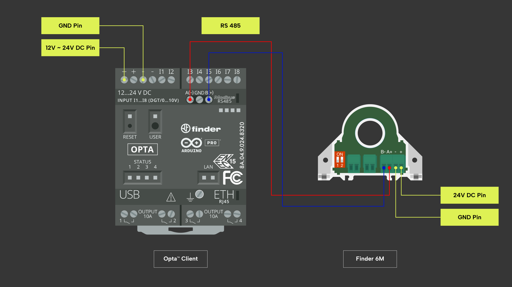
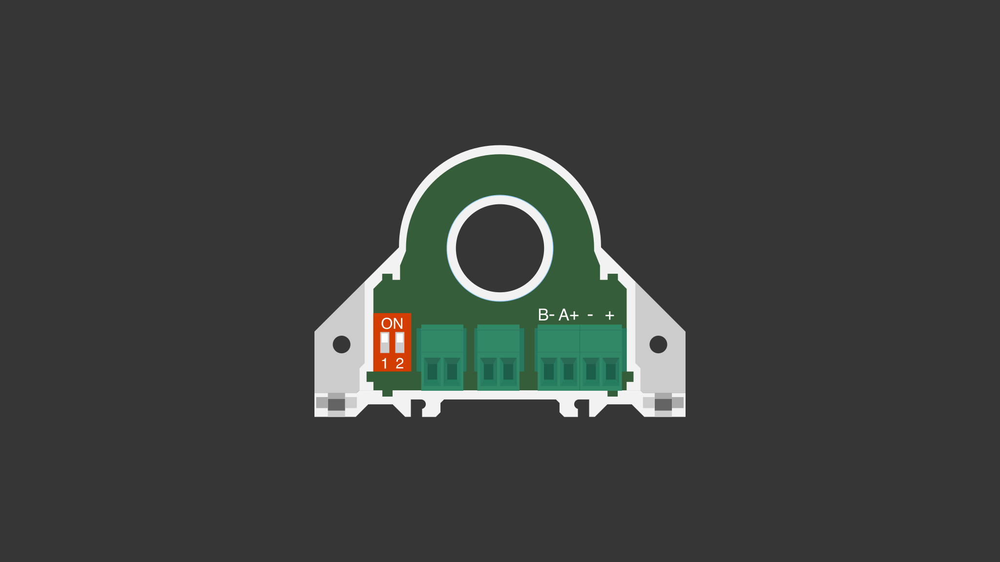

## Panoramica

Finder Opta offre diverse opzioni di interfaccia di comunicazione, tra cui la
porta seriale RS-485. Utilizzando questa porta, è possibile comunicare tramite
il protocollo Modbus RTU. Questo protocollo di comunicazione noto per la sua
efficienza e scalabilità, consente di monitorare dispositivi industriali su
larga scala ed è di fatto uno standard nel settore dell'automazione
industriale. Ciò significa che, una volta collegato ad una serie di
analizzatori di rete che supportano a loro volta il protocollo Modbus RTU,
Finder Opta può essere impiegato come punto focale di un sistema di
monitoraggio e controllo industriale.

Se ad esempio combinassimo Finder Opta con uno o più analizzatori di rete
Finder serie 6M, potremmo automatizzare la gestione energetica e la
manutenzione predittiva di una linea elettrica. Questo permetterebbe di
ottimizzare l'impianto, monitorandone i consumi e fornendone una panoramica
utile a ridurre i costi operativi.

Per questo motivo, in questo tutorial impareremo a implementare la
comunicazione Modbus RTU tramite RS-485 tra Finder Opta e un analizzatore di
rete Finder serie 6M. In particolare, impareremo a:

* Utilizzare il Finder Opta per leggere i registri di un Finder serie 6M, al
  fine di leggere misure dall'analizzatore di rete.
* Utilizzare il Finder Opta per scrivere nei registri di un Finder serie 6M, al
  fine di configurarlo.

Infine presenteremo la libreria `Finder6M`, che permette di semplificare tutte
le operazioni presentate nel corso di questo tutorial.

## Obiettivi

* Imparare a utilizzare il protocollo di comunicazione Modbus RTU su Finder
  Opta per leggere misure da un dispositivo Finder serie 6M.
* Imparare a utilizzare il protocollo di comunicazione Modbus RTU su Finder
  Opta per configurare un dispositivo Finder serie 6M.  

## Requisiti

### Hardware

* PLC Finder Opta con supporto RS-485 (x1).
* Analizzatore di rete Finder serie 6M (x1).
* Alimentatore DIN rail 12VDC/500mA (x1).
* Cavo USB-C® (x1).
* Cavo per la connettività RS-485 con una delle seguenti specifiche (x2):
  * STP/UTP 24-18AWG (non terminato) con impedenza di 100-130Ω.
  * STP/UTP 22-16AWG (terminato) con impedenza di 100-130Ω.

### Software

* [Arduino IDE 1.8.10+](https://www.arduino.cc/en/software), [Arduino IDE
  2.0+](https://www.arduino.cc/en/software) o [Arduino Web
  Editor](https://create.arduino.cc/editor).
* Se si utilizza Arduino IDE offline, è necessario installare le librerie
  `ArduinoRS485` e `ArduinoModbus` utilizzando il Library Manager di Arduino
  IDE.
* Sketch di esempio: [lettura](assets/Opta6MReadExample.zip) e
  [configurazione](assets/Opta6MConfigExample.zip) di un Finder serie 6M.

### Connettività

Per seguire questo tutorial, sarà necessario collegare l'analizzatore di rete
Finder serie 6M alla rete elettrica e fornire un carico adeguato. Sarà inoltre
necessario alimentare il Finder Opta con un alimentatore da 12VDC/500mA e
configurare correttamente la connessione seriale RS-485. Il diagramma
sottostante mostra la configurazione corretta dei collegamenti tra il Finder
Opta e il Finder serie 6M.



La configurazione Modbus del Finder serie 6M è determinata dalla posizione
degli switch DIP, come indicato alla pagina 6 del [manuale
utente](https://cdn.findernet.com/app/uploads/6M.Tx-User-Guide.pdf). In questo
tutorial i parametri di comunicazione previsti sono:

* Indirizzo Modbus: `1`.
* Baudrate: `38400`.

Possiamo impostare questi valori **posizionando entrambi gli switch DIP del
Finder serie 6M alla posizione `UP`**, come mostrato nella figura qui sotto.



## Finder serie 6M e il protocollo Modbus RTU

Nella panoramica di questo tutorial abbiamo discusso la possibilità di
utilizzare il protocollo Modbus RTU su connessione seriale RS-485, per
trasformare Finder Opta nel punto focale di un sistema di monitoraggio
industriale composto di analizzatori di rete Finder serie 6M.

Il Finder serie 6M mettono a disposizione una serie di *holding register*,
ovvero registri dedicati alla memorizzazione di dati che possono essere letti o
scritti da altri dispositivi Modbus. Ogni registro è identificato da un
indirizzo ed è possibile accedere al suo contenuto tramite una richiesta.

Come specificato nel documento [Modbus communication
protocol](https://cdn.findernet.com/app/uploads/Modbus_RS485_6MTx.pdf), le
misure fornite dagli analizzatori di rete Finder serie 6M possono essere
ottenute tramite Modbus effettuando una serie di letture a 16 bit. Per esempio,
la misura dell'energia è rappresentata da un valore a 32 bit ottenuto
combinando la lettura di due registri da 16 bit adiacenti, situati agli
indirizzi Modbus `40089` e `40090`.

È importante notare che, nei dispositivi Finder Serie 6M, gli offset sono tutti
basati sul *register offset*, non sul *byte offset*. Ciò significa che useremo
gli indirizzi Modbus per indicare la posizione di memoria da cui iniziare a
leggere, specificando il numero di registri che desideriamo leggere a partire
da tale indirizzo. Inoltre, su tali dispositivi, l'indirizzamento Modbus parte
da `0`, il che implica che accederemo all'indirizzo Modbus `40006` come
*holding register* numero `5`.

Ulteriori informazioni sul protocollo di comunicazione Modbus sono contennuto
in [questo articolo sul
protocollo](https://docs.arduino.cc/learn/communication/modbus). Tutte le
funzionalità fornite dalla libreria `ArduinoModbus` sono supportate da Finder
Opta.

## Istruzioni

### Configurazione dell'Arduino IDE

Per seguire questo tutorial, sarà necessaria [l'ultima versione dell'Arduino
IDE](https://www.arduino.cc/en/software). Se è la prima volta che configuri il
Finder Opta, dai un'occhiata al tutorial [Getting Started with
Opta](/tutorials/opta/getting-started): in questo tutorial spieghiamo come
installare il Board Manager per la piattaforma Mbed OS Opta, ovvero l'insieme
di tool di base necessari a creare e utilizzare uno sketch per Finder Opta con
Arduino IDE.

Assicurati di installare la versione più recente delle librerie
[ArduinoModbus](https://www.arduino.cc/reference/en/libraries/arduinomodbus/) e
[ArduinoRS485](https://www.arduino.cc/reference/en/libraries/arduinors485/),
poiché verranno utilizzate per implementare la comunicazione Modbus RTU. Per
una breve spiegazione su come installare manualmente le librerie all'interno di
Arduino IDE, consulta [questo
articolo](https://support.arduino.cc/hc/en-us/articles/5145457742236-Add-libraries-to-Arduino-IDE).

### Panoramica del codice

#### Lettura di misure dal Finder serie 6M

Nella prima parte di questo tutorial andremo a scrivere uno sketch che permetta
di leggere alcune misure da un analizzatore di rete Finder serie 6M, per poi a
stamparle su monitor seriale. Il codice completo di questa parte di tutorial è
disponibile [qui](assets/Opta6MReadExample.zip). È possibile estrarre il
contenuto del file `.zip` e copiarlo nella cartella ~/Documents/Arduino, o
alternativamente creare un nuovo sketch chiamato `Opta6MReadExample`
utilizzando Arduino IDE ed incollare il codice presente nel tutorial.

Iniziamo scrivendo un file di configurazione contenente alcune costanti da
utilizzare nello sketch di lettura. In particolare, creeremo un file chiamato
`finder-6m-read.h` all'interno della stessa cartella dello sketch, e al suo
interno inseriremo:

* I valori da utilizzare per inizializzare la comunicazione Modbus tramite
  porta seriale RS-485, compresi indirizzo di Modbus e baudrate del Finder
  serie 6M.
* Gli indirizzi dei registri del Finder serie 6M da cui leggere le misure.
* Il valore di errore restituito dal Finder serie 6M in caso di errori di
  lettura.

Il file di configurazione avrà il seguento contenuto:

```cpp
// Configurazione
#define ADDRESS 1
#define BAUDRATE 38400
#define PREDELAY 1750
#define POSTDELAY 1750
#define TIMEOUT 1000

// Registri
#define REG_FREQUENCY 204
#define REG_ACTIVE_POWER 196
#define REG_APPARENT_POWER 200
#define REG_ENERGY 208

// Errore di lettura
#define INVALID_DATA 0xFFFFFFFF
```

Passiamo ora a scrivere lo sketch `Opta6MReadExample`, che come tutti gli
sketch per Arduino sarà composto da una funzione di `setup()` e una funzione
`loop()`:

```cpp
void setup() {
  // Codice di setup, eseguito all'avvio
}

void loop() {
  // Codice di loop, eseguito all'infinito
}
```

All'inizio del nostro sketch andremo ad importare le librerie ed i file
necessari al funzionamento del programma:

```cpp
#include <Arduino.h>
#include <ArduinoRS485.h>
#include <ArduinoModbus.h>
#include "finder-6m-read.h"

void setup() {
  // Codice di setup, eseguito all'avvio
}

void loop() {
  // Codice di loop, eseguito all'infinito
}
```

In particolare abbiamo importato le librerie:

* `Arduino`: contiene numerose funzionalità di base per le schede Arduino, ed è
quindi buona norma importarla all'inizio di tutti gli sketch.
* `ArduinoRS485`: necessaria a mandare e ricvere data su porta seriale RS-485.
* `ArduinoModbus`: implementa il protocollo Modbus.

Inoltre abbiamo importato il file `finder-6m-read.h` creato in precedenza e
contenente le costanti da utilizzare nello sketch.

A questo punto abbiamo tutto il necessario per scrivere la funzione `setup()`,
eseguita una singola volta all'avvio di Finder Opta. Nel nostro caso all'avvio
del programma è necessario eseguire le seguenti operazioni:

* Configurare i parametri di comunicazione seriale, per poter stampare le
  misure lette sul monitor seriale di Arduino IDE.
* Configurare la comunicazione Modbus su seriale RS-485, settandone i parametri
  di configurazione contenuti nelle costanti.

Il codice qui sotto imposta la velocità di trasmissione della comunicazione
seriale a `9600` e in seguito configura timeout e delay della comunicazione
Modbus. Infine inizializza la comunicazione Modbus con baudrate `38400` e
codifica `8N1`, come previsto dal Finder serie 6M:

```cpp
#include <Arduino.h>
#include <ArduinoRS485.h>
#include <ArduinoModbus.h>
#include "finder-6m-read.h"

void setup()
{
    Serial.begin(9600);

    RS485.setDelays(PREDELAY, POSTDELAY);
    ModbusRTUClient.setTimeout(TIMEOUT);
    ModbusRTUClient.begin(BAUDRATE, SERIAL_8N1);
}

void loop() {
  // Codice di loop, eseguito all'infinito
}
```

Terminato il codice di `setup()`, passiamo alla funzione di `loop()`. In questa
funzione vogliamo leggere alcune misure contenute nei registri del Finder serie
6M, indicando:

* Indirizzo di Modbus del Finder serie 6M.
* Indirizzo del registro da cui iniziare la lettura.
* Numero di bit da leggere cominciando dall'indirizzo di partenza.

In questo esempio, desideriamo leggere frequenza, potenza attiva, potenza
apparente ed energia dal Finder serie 6M. Tutte queste misure sono
rappresentate su 32 bit e abbiamo definito come costanti gli indirizzi degli
*holding register* che le contengono. La cosa più semplice è quindi scrivere
una funzione che, dato un indirizzo di Modbus ed un registro di partenza legga
32 bit dal dispositivo:

```cpp
#include <Arduino.h>
#include <ArduinoRS485.h>
#include <ArduinoModbus.h>
#include "finder-6m-read.h"

void setup()
{
    Serial.begin(9600);

    RS485.setDelays(PREDELAY, POSTDELAY);
    ModbusRTUClient.setTimeout(TIMEOUT);
    ModbusRTUClient.begin(BAUDRATE, SERIAL_8N1);
}

void loop() {
  // Codice di loop, eseguito all'infinito
}

uint32_t modbus6MRead32(uint8_t address, uint16_t reg)
{
    ModbusRTUClient.requestFrom(address, HOLDING_REGISTERS, reg, 2);
    uint32_t data1 = ModbusRTUClient.read();
    uint32_t data2 = ModbusRTUClient.read();
    if (data1 != INVALID_DATA && data2 != INVALID_DATA)
    {
        return data2 << 16 | data1;
    }
    else
    {
        return INVALID_DATA;
    }
}
```

La funzione `modbus6MRead32()` legge dal dispositivo avente indirizzo Modbus
`address`, a partire dal registro `reg`. Si noti che l'ultimo parametro passato
alla funzione `requestFrom()` è l'offset, che come spiegato in precedenza è un
*offset register*: essendo ogni registro lungo 16 bit ed ogni misura lunga 32
bit il valore da passare è `2`. In seguito la funzione verifica che non ci
siano errori di lettura ed in caso affermativo combina le due letture da 16 bit
nei 32 bit della misura: il primo valore letto viene posto nei 16 bit meno
significativi, mentre il secondo valore letto viene posto nei 16 bit più
significativi secondo la notazione LSW-first.

Il codice della funzione `loop()` si limiterà a chiamare la funzione
`modbus6MRead32()` passandogli i giusti parametri, ed in seguito a stampare le
misure su monitor seriale:

```cpp
#include <Arduino.h>
#include <ArduinoRS485.h>
#include <ArduinoModbus.h>
#include "finder-6m-read.h"

void setup()
{
    Serial.begin(9600);

    RS485.setDelays(PREDELAY, POSTDELAY);
    ModbusRTUClient.setTimeout(TIMEOUT);
    ModbusRTUClient.begin(BAUDRATE, SERIAL_8N1);
}

void loop()
{
    int32_t frequency = modbus6MRead32(ADDRESS, REG_FREQUENCY);
    int32_t activePower = modbus6MRead32(ADDRESS, REG_ACTIVE_POWER);
    int32_t apparentPower = modbus6MRead32(ADDRESS, REG_APPARENT_POWER);
    int32_t energy = modbus6MRead32(ADDRESS, REG_ENERGY);

    Serial.print("Frequency = " + (frequency != INVALID_DATA ? String(frequency) : String("read error!")));
    Serial.print(", Active power = " + (activePower != INVALID_DATA ? String(activePower) : String("read error!")));
    Serial.print(", Apparent power = " + (apparentPower != INVALID_DATA ? String(apparentPower) : String("read error!")));
    Serial.println(", Energy = " + (energy != INVALID_DATA ? String(energy) : String("read error!")));

    delay(1000);
}

uint32_t modbus6MRead32(uint8_t address, uint16_t reg)
{
    ModbusRTUClient.requestFrom(address, HOLDING_REGISTERS, reg, 2);
    uint32_t data1 = ModbusRTUClient.read();
    uint32_t data2 = ModbusRTUClient.read();
    if (data1 != INVALID_DATA && data2 != INVALID_DATA)
    {
        return data2 << 16 | data1;
    }
    else
    {
        return INVALID_DATA;
    }
}
```

A questo punto sul monitor seriale di Arduino IDE dovremmo vedere un output di
questo tipo ripetuto una volta al secondo:

```text
Frequency = 4991, Active power = 0, Apparent power = 0, Energy = 0
```

#### Configurazione del Finder serie 6M

Nella seconda parte di questo tutorial scriveremo uno sketch che configura il
Finder serie 6M, cambiando indirizzo di Modbus del dispositivo. Questo step è
particolarmente importante se si desidera utilizzare più di un Finder serie 6M,
poichè ciascuno dovrà avere un indirizzo di Modbus univoco. Il codice completo
di questo secondo sketch è disponibile [qui](assets/Opta6MConfigExample.zip). È
possibile estrarre il contenuto del file `.zip` e copiarlo nella cartella
`~/Documents/Arduino`, o alternativamente creare un nuovo sketch chiamato
`Opta6ConfigExample` utilizzando Arduino IDE ed incollare il codice presente
nel tutorial.

Iniziamo scrivendo un file di configurazione contenente alcune costanti da
utilizzare nello sketch. In particolare, creeremo un file chiamato
`finder-6m-config.h` all'interno della stessa cartella dello sketch, e al suo
interno inseriremo:

* I valori da utilizzare per inizializzare la comunicazione Modbus tramite
  porta seriale RS-485, compresi indirizzo di Modbus e baudrate del Finder
  serie 6M.
* Gli indirizzi dei registri del Finder serie 6M in cui scrivere i comandi di
  configurazione.
* I valori in byte dei comandi di configurazione da mandare al Finder serie 6M.
* L'indirizzo del Finder serie 6M da cui effettuare una lettura di test, e il
  valore di errore restituito dal dispositivo in caso di errori.

Il file di configurazione avrà il seguento contenuto:

```cpp
// Configurazione
#define ADDRESS 1
#define BAUDRATE 38400
#define PREDELAY 1750
#define POSTDELAY 1750
#define TIMEOUT 1000

// Registri
#define REG_MODBUS_ADDRESS 2
#define REG_BAUDRATE 4
#define REG_FREQUENCY 204
#define REG_COMMAND 251

// Comandi
#define BAUDRATE_CODE_38400 5
#define COMMAND_SAVE 0xC1C0

// Errore di lettura
#define INVALID_DATA 0xFFFFFFFF
```

Passiamo ora a scrivere lo sketch `Opta6ConfigExample`, che come tutti gli
sketch per Arduino sarà composto da una funzione di `setup()` e una funzione
`loop()`:

```cpp
void setup() {
  // Codice di setup, eseguito all'avvio
}

void loop() {
  // Codice di loop, eseguito all'infinito
}
```

All'inizio del nostro sketch andremo ad importare le librerie ed i file
necessari al funzionamento del programma:

```cpp
#include <Arduino.h>
#include <ArduinoRS485.h>
#include <ArduinoModbus.h>
#include "finder-6m-read.h"

void setup() {
  // Codice di setup, eseguito all'avvio
}

void loop() {
  // Codice di loop, eseguito all'infinito
}
```

In particolare abbiamo importato le stesse librerie dello sketch precendente e
il file `finder-6m-config.h` creato in precedenza e contenente le costanti da
utilizzare nello sketch.

A questo punto abbiamo tutto il necessario per scrivere la funzione `setup()`,
eseguita una singola volta all'avvio di Finder Opta. Nel nostro caso all'avvio
del programma è necessario eseguire le seguenti operazioni:

* Configurare i parametri di comunicazione seriale, per poter stampare alcuni
  messaggi sul monitor seriale di Arduino IDE.
* Configurare la comunicazione Modbus su seriale RS-485, settandone i parametri
  di configurazione contenuti nelle costanti.
* Configurare un indirizzo di Modbus ed un baudrate sul Finder serie 6M, poi
  stampare dei messaggi di aiuto per l'utente ed attendere che esso segua le
  istruzioni.

Infatti, una volta che lo sketch avrà configurato indirizzo di Modbus e
baudarate sarà necessario spegnere il Finder serie 6M, posizionare gli switch
DIP in posizione `DOWN` e riavviare il dispositivo. Lo sketch darà all'utente
20 secondi per eseguire questa operazione. La posizione degli switch DIP
desiderata è mostrata nella figura sotto, e come specificato nel manuale utente
del Finder serie 6M garantisce che il dispositivo utilizzi la configurazione
Modbus custom.


Il codice qui sotto esegue alcune delle stesse operazioni viste nello sketch
precedente, ma in più si occupa di effettuare alcune scritture sul Finder serie
6M chiamando la funzione `modbus6MWrite16()` che scriveremo a breve:

```cpp
#include <Arduino.h>
#include <ArduinoRS485.h>
#include <ArduinoModbus.h>
#include "finder-6m-config.h"

constexpr uint8_t NEW_ADDRESS = 20;

void setup()
{
    Serial.begin(9600);

    RS485.setDelays(PREDELAY, POSTDELAY);
    ModbusRTUClient.setTimeout(TIMEOUT);
    ModbusRTUClient.begin(BAUDRATE, SERIAL_8N1);

    // Cambia indirizzo Modbus
    modbus6MWrite16(ADDRESS, REG_MODBUS_ADDRESS, NEW_ADDRESS);
    // Imposta baudarate
    modbus6MWrite16(ADDRESS, REG_BAUDRATE, BAUDRATE_CODE_38400);

    // Salva la configurazione
}

void loop() {
  // Codice di loop, eseguito all'infinito
}

void modbus6MWrite16(uint8_t address, uint16_t reg, uint16_t toWrite)
{
  // Scrivi toWrite nel registro reg del dispositivo con indirizzo address
}
```

La funzione `modbus6MWrite16()` si coccupa di scrivere comandi da 16 bit nel
registro indicato del dispositivo con indirizzo Modbus pari ad `address`:

```cpp
#include <Arduino.h>
#include <ArduinoRS485.h>
#include <ArduinoModbus.h>
#include "finder-6m-config.h"

constexpr uint8_t NEW_ADDRESS = 20;

void setup()
{
    Serial.begin(9600);

    RS485.setDelays(PREDELAY, POSTDELAY);
    ModbusRTUClient.setTimeout(TIMEOUT);
    ModbusRTUClient.begin(BAUDRATE, SERIAL_8N1);

    // Cambia indirizzo Modbus
    modbus6MWrite16(ADDRESS, REG_MODBUS_ADDRESS, NEW_ADDRESS);
    // Imposta baudarate
    modbus6MWrite16(ADDRESS, REG_BAUDRATE, BAUDRATE_CODE_38400);

    // Salva la configurazione
}

void loop() {
  // Codice di loop, eseguito all'infinito
}

void modbus6MWrite16(uint8_t address, uint16_t reg, uint16_t toWrite)
{
    ModbusRTUClient.holdingRegisterWrite(address, reg, toWrite);
}
```

A questo punto non ci resta che salvare la configurazione mandando un nuovo
comando, stampare a terminale le istruzioni per l'utente e aspettare venti
secondi:

```cpp
#include <Arduino.h>
#include <ArduinoRS485.h>
#include <ArduinoModbus.h>
#include "finder-6m-config.h"

constexpr uint8_t NEW_ADDRESS = 20;

void setup()
{
    Serial.begin(9600);

    RS485.setDelays(PREDELAY, POSTDELAY);
    ModbusRTUClient.setTimeout(TIMEOUT);
    ModbusRTUClient.begin(BAUDRATE, SERIAL_8N1);

    // Cambia indirizzo Modbus
    modbus6MWrite16(ADDRESS, REG_MODBUS_ADDRESS, NEW_ADDRESS);
    // Imposta baudarate
    modbus6MWrite16(ADDRESS, REG_BAUDRATE, BAUDRATE_CODE_38400);

    modbus6MWrite16(ADDRESS, REG_COMMAND, COMMAND_SAVE);
    delay(3000);
    Serial.println("Waiting 20s while you:");
    Serial.println("1. Power OFF the 6M.");
    Serial.println("2. Set both DIP switches DOWN.");
    Serial.println("3. Power back ON the 6M.");
    delay(20000);
}

void loop() {
  // Codice di loop, eseguito all'infinito.
}

void modbus6MWrite16(uint8_t address, uint16_t reg, uint16_t toWrite)
{
    ModbusRTUClient.holdingRegisterWrite(address, reg, toWrite);
}
```

Si noti che, prima di stampare le istruzioni aspettiamo 3 secondi per dare
all'utente tempo di collegarsi al monitor seriale di Arduino IDE. L'output
mostrato sarà il seguente:

```text
Waiting 20s while you:
1. Power OFF the 6M.
2. Set both DIP switches DOWN.
3. Power back ON the 6M.
```

Nel `loop()` utilizzeremo il codice scritto precedentemente in questo tutorial,
per effettuare una lettura al nuovo indirizzo Modbus e verificare che essa vada
a buon fine. In caso di successo, avremo la certezza la configurazione sia
stata applicata al Finder serie 6M:

```cpp
#include <Arduino.h>
#include <ArduinoRS485.h>
#include <ArduinoModbus.h>
#include "finder-6m-config.h"

constexpr uint8_t NEW_ADDRESS = 20;

void setup()
{
    Serial.begin(9600);

    RS485.setDelays(PREDELAY, POSTDELAY);
    ModbusRTUClient.setTimeout(TIMEOUT);
    ModbusRTUClient.begin(BAUDRATE, SERIAL_8N1);

    // Change Modbus address
    modbus6MWrite16(ADDRESS, REG_MODBUS_ADDRESS, NEW_ADDRESS);
    // Baudrate 38400 has code 5
    modbus6MWrite16(ADDRESS, REG_BAUDRATE, BAUDRATE_CODE_38400);

    // Save above settings, we have 20 seconds to lower the DIP switches
    modbus6MWrite16(ADDRESS, REG_COMMAND, COMMAND_SAVE);
    delay(3000);
    Serial.println("Waiting 20s while you:");
    Serial.println("1. Power OFF the 6M.");
    Serial.println("2. Set both DIP switches DOWN.");
    Serial.println("3. Power back ON the 6M.");
    delay(20000);
}

void loop()
{
    int32_t frequency = modbus6MRead32(NEW_ADDRESS, REG_FREQUENCY);
    Serial.println("Frequency = " + (frequency != INVALID_DATA ? String(frequency) : String("read error!")));
    delay(1000);
}

void modbus6MWrite16(uint8_t address, uint16_t reg, uint16_t toWrite)
{
    ModbusRTUClient.holdingRegisterWrite(address, reg, toWrite);
}

uint32_t modbus6MRead32(uint8_t address, uint16_t reg)
{
    ModbusRTUClient.requestFrom(address, HOLDING_REGISTERS, reg, 2);
    uint32_t data1 = ModbusRTUClient.read();
    uint32_t data2 = ModbusRTUClient.read();
    if (data1 != INVALID_DATA && data2 != INVALID_DATA)
    {
        return data2 << 16 | data1;
    }
    return INVALID_DATA;
}
```

In caso di successo l'output mostrato sarà il seguente, e si ripeterà una volta
al secondo:

```text
Frequency = 4991
```

## Utilizzo della libreria Finder6M

Per semplificare tutte le operazioni eseguite in questo tutorial, è possibile
utilizzare la libreria `Finder6M`. In questo caso, il codice di `setup()` del
primo sketch diventa molto più semplice, poiché la libreria fornisce funzioni
integrate per configurare i parametri Modbus:

```cpp
#include <Finder6M.h>
#include "finder-6m-read.h"

Finder6M f6m;

void setup()
{
    Serial.begin(38400);

    f6m.init(BAUDRATE);
}

void loop()
{
    // Codice di loop, eseguito all'infinito 
}
```

Anche il codice nel `loop()` diventa più semplice, e non è più necessario
scrivere funzioni per interagire con i registri, ne conoscere gli indirizzi dei
registri:

```cpp
#include <Finder6M.h>

Finder6M f6m;
constexpr uint8_t ADDRESS = 1;
constexpr uint16_t BAUDRATE = 38400;

void setup()
{
    Serial.begin(38400);

    f6m.init(BAUDRATE);
}

void loop()
{
    int32_t frequency = f6m.getFrequency(ADDRESS);
    int32_t activePower = f6m.getActivePower(ADDRESS);
    int32_t apparentPower = f6m.getApparentPower(ADDRESS);
    int32_t energy = f6m.getEnergy(ADDRESS);

    Serial.println("Frequency = " + (frequency != INVALID_DATA ? String(frequency) : String("read error!")));
    Serial.println("Active power = " + (activePower != INVALID_DATA ? String(activePower) : String("read error!")));
    Serial.println("Apparent power = " + (apparentPower != INVALID_DATA ? String(apparentPower) : String("read error!")));
    Serial.println("Energy = " + (energy != INVALID_DATA ? String(energy) : String("read error!")));
    
    delay(1000);
}
```

Si noti inoltre che i valori letti dai registri del Finder serie 6M sono in
centesimi, mentre la libreria fornisce direttamente le funzioni per ottenere le
misure convertite.

Anche il codice del secondo sketch viene semplificato se si utilizza la
libreria `Finder6M`:

```cpp
#include <Finder6M.h>

Finder6M f6m;
constexpr uint8_t ADDRESS = 1;
constexpr uint8_t NEW_ADDRESS = 20;
constexpr uint16_t BAUDRATE = 38400;

void setup()
{
    Serial.begin(9600);

    f6m.init();

    f6m.setModbusAddress(NEW_ADDRESS, ADDRESS);
    f6m.setBaudrate(ADDRESS, 38400);

    f6m.saveSettings(ADDRESS);
    delay(5000);
    Serial.println("Waiting 20s while you:");
    Serial.println("1. Power OFF the 6M.");
    Serial.println("2. Set both DIP switches DOWN.");
    Serial.println("3. Power back ON the 6M.");
    delay(20000);
}

void loop()
{
    int32_t frequency = f6m.getFrequency(NEW_ADDRESS);
    Serial.println("   frequency = " + (frequency != INVALID_DATA ? String(frequency) : String("read error!")));
    delay(1000);
}
```

In questo caso non è necessario nemmeno conoscere i codici dei comandi da
inviare al Finder serie 6M. Per saperne di più sulla libreria, visita la
[repository ufficiale](https://github.com/dndg/Finder6M).

## Conclusioni

In questo tutorial abbiamo imparato ad implementare la comunicazione Modbus
tramite porta seriale RS-485 tra un Finder Opta ed un analizzatore di rete
Finder serie 6M. Attraverso esempi pratici, abbiamo visto come leggere misure e
configurare i Finder serie 6M utilizzando Finder Opta. Inoltre, abbiamo
presentato la libreria `Finder6M` per semplificare ulteriormente queste
operazioni.

Con le conoscenze acquisite sarà possibile implementare soluzioni di
monitoraggio e analisi delle reti industriale, impiegando Finder Opta come
fulcro di un sistema composto da multiple analizzatori di rete Finder serie 6M.
